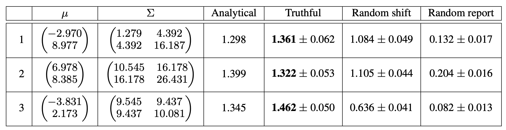

# Credible Sample Elicitation

This code is the official Matlab implementation of our paper "[Credible Sample Elicitation](https://arxiv.org/abs/1910.03155)" accepted by AISTATS2021.

In those experiments (see Table 1 in the paper), we apply our proposed mechanism to the synthetic data drawn from 2-D Gaussian distributions. It is demonstrated that truthful reports lead to higher scores.

# Requirements

Our implementation is based on the CVX package, which is a state-of-the-art tool for solving convex optimization problems. One can find download links and relevant documents [here](http://cvxr.com).

We carried out the experiments using MATLAB 2019b Update 2 (9.7.0.1247435).

# Run the code

There are three parameters in `numexp.m` need to be set before running the code:

1. `expidx_list`: a list of integers, chosen from {1,2,3}.  For example, `expidx_list=[1, 2]`. It specifies the preset example(s) used in the experiment. There are three preset examples in our code (for details see `generate_samples.m`).
2. `uttype`: an integer that specifies the report type. `uttype=0`: truthful report; `uttype=1`: random shift report; `uttype=2`: random report.
3. `nrepeats`: an integer that specifies the number of repeated experiments. We run multiple experiments to calculate the mean and standard deviation of the resulting score.

After setting those parameters, one can run the code in MATLAB with
```Matlab
>> numexp(1000)
```
In the above, `1000` is the number of samples used for estimating the expected score. It can be changed to other values.

# Results

We repeat Table 1 in our paper here:



Please refer to section 6 in our paper for a detailed description.
